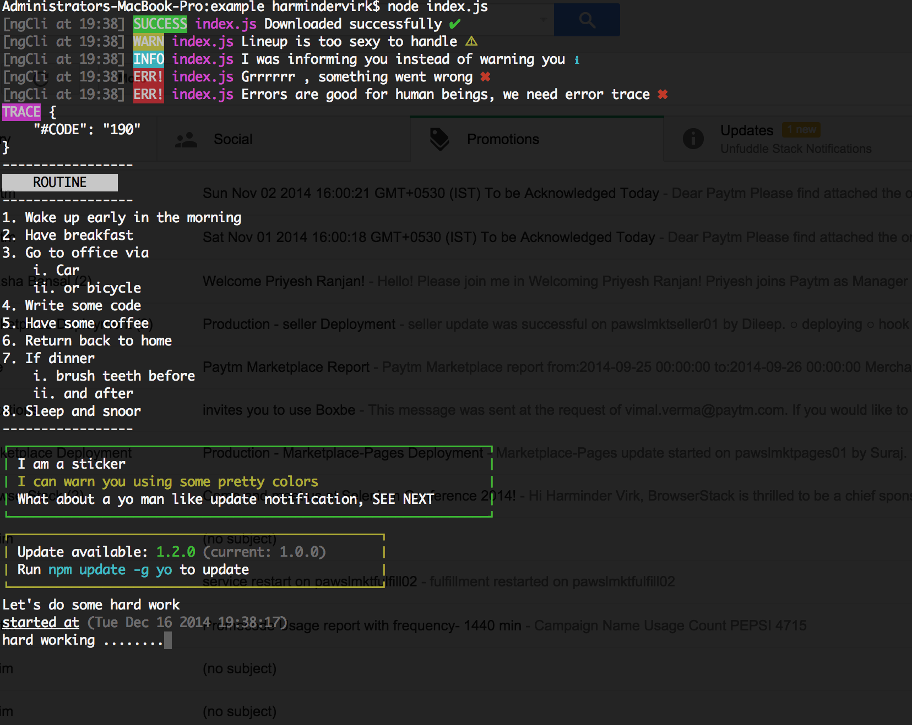

Take cares of all tedious tasks you have to do while writing cli app/tools.

Table of Contents

* Getting Started
* Objects List
* API
* Examples

## Getting Started

### Install

```
npm install lineup
```

### Initiating

```javascript
var LineUp = require('lineup');
var lineup = new LineUp()

/*
  ----------------------------
        OR WITH OPTIONS
  ---------------------------
*/

logger_options = {
  'identifier': 'npm', // just for example
  'showDateTime': true,
  'filePath': __filename,
  'showIcons': true,
  'dateTimeFormat': 'HH:MM'
}

var lineup = new LineUp(logger_options)

```

* **identifier** get's prepended with every log command you run [npm] "your log"

* **showDateTime** if true will concatenate identifier

* **filePath** if you want to show from which file log has been generated.

* **showIcons** may be you like graphics

* **dateTimeFormat** time format for above date

> Above options only work with the logger object

### Objects List

Above i mentioned something about logger object, now let's have a look at available objects and their methods.

* **log** to log messages to console
  * **success**: output a success message
  * **error** : output error message and exit process
  * **warn** : output warning
  * **info** : inform user


* **highlight** creates a highlighter section
  * **start** starts highlighter section
  * **end** end higlighter section


* **print** print list items using array and object ( values only )
  * **ol** prints ordered list
  * **li** prints unordered list


* **progress** creates a minimal progress ticker
  * **start** start new progress ticker
  * **stop** stop above started progress ticker and shows time elapsed.

* **sticker** creates a bordered sticker
  * **note** add new note to be shown inside sticker [can have multiple]**
  * **show** show above added sticker notes


### See examples/index.js for list of all example
